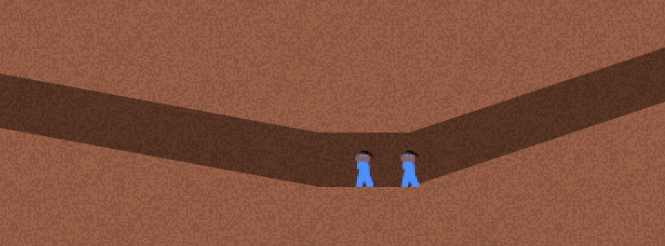

# waypoint_based_destructible_terrain

A waypoint net that is both used for AI player navigation and rendering a destructible terrain for 2D side-scrolling games. 

Why? In the context of destructible two-dimensional (2D) landscapes, conventional approaches involve the usage of either a vast grid comprising individual pixels (bitmap) or a polygon-based approach. Advanced techniques such as marching squares or quadtrees are often employed to enhance these approaches. However, both approaches (bitmaps and polygons) encounter big challenges when moving AI players within an unstable environment. Waypoints are usually only used in games with static landscapes.

Open https://772.github.io/waypoint_based_destructible_terrain/ to test an example.

## Features

- Pixel perfect precision without bitmap.
- Only one dependency: bevy.
- Less than 1000 lines of safe Rust code.
- 100% free. Forever and always.
- Open Source under GPLv3.



## How to update the wasm in this repository

```
cargo build --target wasm32-unknown-unknown --release
wasm-bindgen --no-typescript --target web --out-dir ./ --out-name "waypoint_based_destructible_terrain" ./target/wasm32-unknown-unknown/release/waypoint_based_destructible_terrain.wasm
git add -A && git commit -m "Update wasm." && git push
```

## Contribution

Unless you explicitly state otherwise, any contribution intentionally submitted for inclusion in the work by you, shall be licensed as GNU General Public License 3, without any additional terms or conditions.
